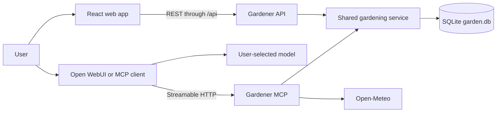

# Intelligent Gardening

Intelligent Gardening is a model-independent gardening platform with a React web application, REST/OpenAPI service, and MCP tools for Open WebUI or another MCP-compatible client.

The backend does not contain an AI model. The connected client chooses the model, while Intelligent Gardening stores garden information and performs tool actions.

## Architecture



The API and MCP processes are built from the same TypeScript server application. They use the same service layer and share one SQLite database through a Docker volume.

| Component | Technology | Default address |
| --- | --- | --- |
| Standalone web app | React, TypeScript, Vite, Nginx | `http://localhost:5200` |
| REST/OpenAPI API | TypeScript, Express, Zod | `http://localhost:8100` |
| MCP server | TypeScript MCP SDK, Streamable HTTP | `http://localhost:8101/mcp` |
| Optional Open WebUI | Open WebUI container | `http://localhost:5000` |
| Storage | SQLite Docker volume | `/data/garden.db` |

## Features available now

- Create and list garden profiles with a location and hardiness zone.
- Add plants with variety, quantity, planting date, and notes.
- List active plants and archive plants that are no longer growing.
- Schedule dated gardening tasks, list outstanding work, and mark tasks complete.
- Store reference documents with publisher, region, tags, and source URL.
- Search saved references with lexical ranking and return citation metadata.
- Get the current date and time for date-sensitive planning through MCP.
- Get live conditions and forecasts from Open-Meteo for a saved garden through MCP.
- Use gardening operations through REST/OpenAPI or MCP.
- Run an independent React frontend that verifies its connection to the API.

The React frontend currently provides the web foundation and server-status interface. Garden-management forms and built-in chat are not implemented in the frontend yet; complete garden operations are available through REST and MCP clients.

## Repository structure

```text
apps/
  server/
    src/        REST API, MCP tools, service layer, and SQLite access
    tests/      Service tests
    Dockerfile
  web/
    src/        React and TypeScript frontend
    Dockerfile
    nginx.conf  Static hosting and /api reverse proxy

compose.yaml
package.json    npm workspace configuration
```

## Prerequisites

- Docker with Docker Compose
- Node.js 22 or newer only for development outside Docker

## Configure the application

Copy the example environment file:

```bash
cp .env.example .env
```

Generate private values for `GARDEN_API_KEY` and `WEBUI_SECRET_KEY`:

```bash
openssl rand -hex 32
```

Run the command twice and place the two different values in `.env`:

```dotenv
GARDEN_API_KEY=your-gardener-api-secret
WEBUI_SECRET_KEY=your-open-webui-secret
OLLAMA_BASE_URL=http://host.docker.internal:11434
```

## Run the core application

Build and start the web app, REST API, and MCP server:

```bash
docker compose up -d --build gardener-api gardener-mcp gardener-web
```

Check their status:

```bash
docker compose ps
```

Open the standalone frontend at `http://localhost:5200`.

Check the API:

```bash
curl http://localhost:8100/health
```

Expected response:

```json
{"status":"ok"}
```

## Use the REST API

Load the environment variables:

```bash
set -a
source .env
set +a
```

Create a garden:

```bash
curl -X POST http://localhost:8100/gardens \
  -H "Authorization: Bearer $GARDEN_API_KEY" \
  -H "Content-Type: application/json" \
  -d '{"name":"Backyard","location":"Portland, OR","hardiness_zone":"8b"}'
```

List saved gardens:

```bash
curl http://localhost:8100/gardens \
  -H "Authorization: Bearer $GARDEN_API_KEY"
```

The complete API description and request schemas are available at `http://localhost:8100/openapi.json`.

## Use with Open WebUI

Start the optional Open WebUI profile:

```bash
docker compose --profile open-webui up -d --build
```

Open `http://localhost:5000`, sign in, and configure a model provider supported by Open WebUI.

As an administrator, add an external MCP tool server:

```text
Type: Streamable HTTP
URL: http://gardener-mcp:8001/mcp
Authentication: None
```

Use `gardener-mcp:8001` inside Open WebUI. The host address `localhost:8101` is for clients running directly on the host.

After verification, enable the tools in a chat and try:

```text
Create a garden named Backyard in Portland, Oregon, hardiness zone 8b.
```

```text
Add four Roma tomato plants to my Backyard garden.
```

```text
Show my outstanding garden tasks.
```

The current MCP endpoint has no bearer-token validation and is intended for local development. Do not expose port `8101` publicly.

## Local TypeScript development

Install workspace dependencies:

```bash
npm install
```

Run the backend:

```bash
npm run dev:server
```

In another terminal, run the frontend:

```bash
npm run dev:web
```

The Vite server runs at `http://localhost:5173` and proxies `/api` to `http://localhost:8100`.

Run all checks:

```bash
npm run typecheck
npm test
npm run build
```

## Stop the application

```bash
docker compose --profile open-webui down
```

Garden data remains in the `gardener-data` Docker volume. Running `docker compose down -v` also deletes the database and Open WebUI data volumes.
